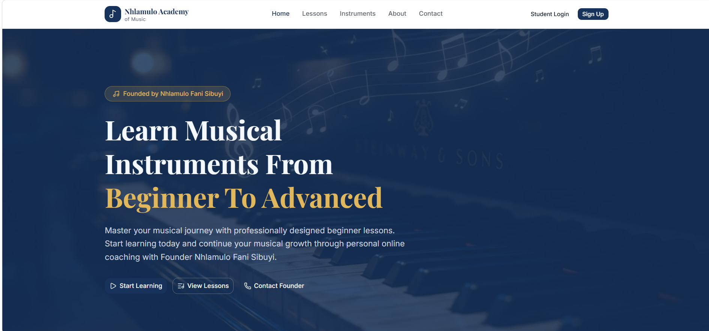

# Nhlamulo Academy of Music



## Project Overview
Nhlamulo Academy of Music is a comprehensive online platform designed to provide professional music education for students ranging from absolute beginners to advanced learners. The platform offers a structured curriculum across various musical instruments and music theory, founded by **Nhlamulo Fani Sibuyi**.

## Live Site
You can visit the live application here: [https://nhlamulo-academy-of-music.vercel.app/](https://nhlamulo-academy-of-music.vercel.app/)

## Key Features
- **Structured Lessons**: Step-by-step curriculum for various instruments.
- **Music Theory**: In-depth theoretical knowledge to complement practical skills.
- **Interactive Learning**: Integrated quizzes and progress tracking.
- **Personal Coaching**: Direct access to the founder for advanced guidance.
- **Responsive Design**: Optimized for a seamless experience across all devices.

## Tech Stack
- **Framework**: [Next.js](https://nextjs.org/) (App Router)
- **Styling**: [Tailwind CSS](https://tailwindcss.com/)
- **UI Components**: [Shadcn UI](https://ui.shadcn.com/)
- **Animations**: [Framer Motion](https://www.framer.com/motion/)
- **Icons**: [Lucide React](https://lucide.dev/)
- **Deployment**: [Vercel](https://vercel.com/)

## Getting Started

First, install the dependencies:

```bash
pnpm install
```

Then, run the development server:

```bash
pnpm dev
```

Open [http://localhost:3000](http://localhost:3000) with your browser to see the result.

## Development
This project was initially bootstrapped with [v0](https://v0.app) and is continuously improved through collaborative development.
